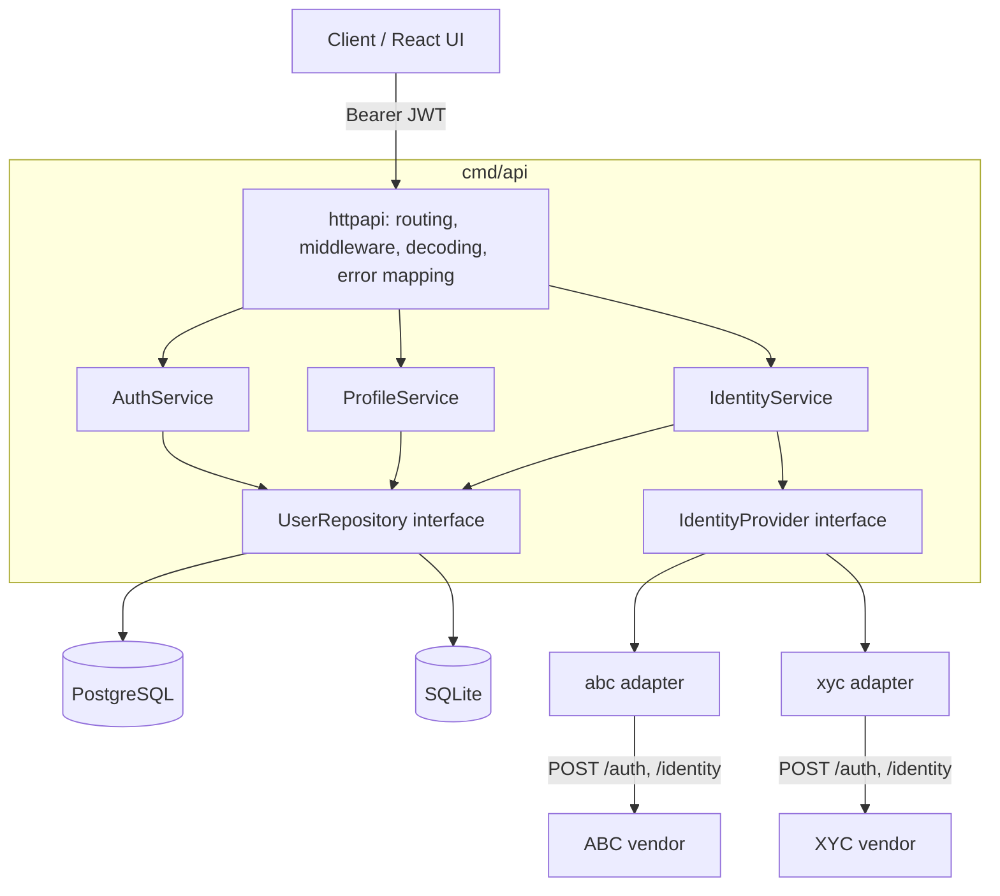

# Rolodex

A small identity service built for the LoginID code review exercise. It:

1. stores **user profiles** and **user credentials** behind a database-agnostic DAO
   (repository) with **PostgreSQL** and **SQLite** implementations,
2. exposes a **JWT-secured REST API** to search and retrieve profiles, and
3. connects to **third-party identity providers** (ABC and XYC) through a common
   connector contract to enrich profiles with vendor PII.

The exercise prioritises design and reasoning over completeness, so the code is
deliberately small (about 3k lines of Go plus 1k lines of tests) and every layer is
test-covered. Deeper
rationale lives in [docs/DESIGN.md](docs/DESIGN.md).

## Assumptions

PostgreSQL is the reference datastore. Persistence sits behind a `UserRepository`
interface so SQLite (implemented) or CockroachDB (wire-compatible with the Postgres
implementation) can be substituted without touching business logic. "Multiple
databases" is read as *interchangeable implementations behind one DAO contract*, not
writing to several databases at once.

A user has exactly one profile and one or more credentials (`password`, `oauth`,
`passkey`). Passwords are hashed with Argon2id and are never returned by the API or
written to logs.

The REST API uses short-lived HS256 bearer JWTs issued by `POST /api/v1/auth/login`.
ABC and XYC are treated as interchangeable implementations of an `IdentityProvider`
interface. Their `/auth` + `/identity` contract is treated as an external contract we
do not control.

External calls use explicit timeouts, bounded retries with jittered exponential
backoff (transient failures only) and normalised errors. A failing vendor degrades
enrichment, it never fails the request.

Production concerns such as distributed tracing, circuit breaking, secret management
and refresh tokens are represented architecturally and listed under
[What I would add in production](#what-i-would-add-in-production) rather than
implemented exhaustively.

Other defaults: UUID identifiers, JSON over HTTP(S), parameterised SQL only,
connection pooling, embedded migrations (goose), structured logging (`log/slog`),
`context.Context` propagated end to end, configuration from environment variables.

## Quick start

Requirements: Docker (with Compose) and Make. Go 1.26+ and Node 20+ only for running
outside Docker.

```bash
make up            # creates .env from .env.example, builds and starts everything
```

| Service      | URL                      | Notes                                 |
| ------------ | ------------------------ | ------------------------------------- |
| Web UI       | http://localhost:3000    | React app served by nginx             |
| API          | http://localhost:8080    | OpenAPI spec in `api/openapi.yaml`    |
| Mock vendors | :9001 (ABC), :9002 (XYC) | XYC injects 503s to exercise retries  |

Seeded users: `admin`, `ada`, `grace`, `alan`, `katherine`, all with the
`SEED_PASSWORD` from `.env`.

```bash
TOKEN=$(curl -s -X POST localhost:8080/api/v1/auth/login \
  -H 'Content-Type: application/json' \
  -d '{"username":"admin","password":"<SEED_PASSWORD>"}' | jq -r .access_token)

curl -s "localhost:8080/api/v1/users?name=grace" -H "Authorization: Bearer $TOKEN"
curl -s -X POST "localhost:8080/api/v1/users/<id>/enrich?provider=abc,xyc" \
  -H "Authorization: Bearer $TOKEN"
```

Without Docker (SQLite): `make env`, then `make run-mock`, `make seed-local`,
`make run-api` and `make web` (http://localhost:5173) in separate terminals.

Demo flow in the UI: sign in as `admin`, search by name for "a", open a profile and
click **Check all**. Grace gets her missing street and postal code from ABC; Katherine
is verified by both vendors except for ABC's stale street address; Alan is unknown to
ABC but fully enriched by XYC.

## Architecture



Layers depend inward only: handlers -> services -> interfaces. Concrete databases and
vendors are chosen once in `cmd/api/main.go` (the composition root).

```
cmd/
  api/            composition root, graceful shutdown
  mockvendors/    fake ABC (:9001) and XYC (:9002) vendors
  seed/           idempotent demo data loader
internal/
  config/         env-var configuration, validated at startup
  domain/         entities, value types, sentinel errors (no dependencies)
  repository/     UserRepository contract
    postgres/     PostgreSQL (and CockroachDB) implementation
    sqlite/       SQLite implementation (pure Go, no cgo)
    repositorytest/  one contract suite run against every implementation
    factory/      picks an implementation from DB_DRIVER
  service/        business logic: auth, profiles, identity enrichment
  provider/       IdentityProvider contract + resilient vendor HTTP client
    abc/ xyc/     vendor adapters (wire format -> domain.Identity)
  httpapi/        chi router, middleware, handlers, error envelope
  security/       Argon2id hasher, JWT issuer/verifier
  mockvendor/     mock vendor implementation used by cmd/mockvendors and tests
migrations/       embedded goose migrations per dialect
api/openapi.yaml  API contract
```

## API

| Method | Path                          | Auth | Purpose                                            |
| ------ | ----------------------------- | ---- | -------------------------------------------------- |
| POST   | `/api/v1/auth/login`          | -    | Username + password -> access token (rate limited) |
| GET    | `/api/v1/me`                  | JWT  | Caller identity                                    |
| GET    | `/api/v1/users`               | JWT  | Search by `name`, `phone`, `username` (AND)        |
| POST   | `/api/v1/users`               | JWT  | Create user + profile + password credential        |
| GET    | `/api/v1/users/{id}`          | JWT  | Profile and credential methods                     |
| POST   | `/api/v1/users/{id}/enrich`   | JWT  | Enrich from `provider=abc,xyc` (default all)       |
| GET    | `/api/v1/providers`           | JWT  | Configured providers                               |
| GET    | `/healthz`, `/readyz`         | -    | Liveness, readiness (datastore ping)               |

Errors always use one envelope:
`{"error":{"code":"invalid_input","message":"...","fields":{...},"request_id":"..."}}`.

## Frontend

`web/` is a deliberately thin React 19 + TypeScript + Vite client. The time budget went
into the backend, but the UI demonstrates the API contract end to end.

```
web/src/
  api/          typed API client (client.ts), wire types, error description
  auth/         in-memory session context, provider, route guard
  components/   reusable styled-components primitives: Button, TextField, Card,
                Badge, Alert, Spinner, Layout, EnrichmentResults
  pages/        login, search, profile + enrichment, add user
  styles/       theme tokens (typed DefaultTheme) and global styles
```

- **Reusable primitives:** components consume theme tokens only, use transient
  `$props` so styling props never reach the DOM, and share semantic `Tone`s
  (`success`, `warning`, `danger`, `info`, `neutral`) between badges and alerts.
- **Session:** the JWT is held in the API client's closure, never in `localStorage`,
  limiting XSS exposure. A 401 or token expiry signs the user out.
- **PII hygiene:** search terms are kept in memory, not in the URL, so names and phone
  numbers stay out of browser history and server logs; cached results are cleared on
  sign-out. `Referrer-Policy: no-referrer` and a CSP are set by nginx.
- **Errors:** the API's field errors map onto form fields; other errors show the
  `request_id` so a support ticket can be traced to a log line.
- **Accessibility:** labelled inputs with `aria-describedby` errors, `role="alert"`
  messages, `aria-pressed` on toggle buttons and visible focus rings.
- **Tests:** Vitest + Testing Library cover the API client, every component and page,
  and the full auth flow (login, 401 auto-logout, sign-out); coverage is ~97%.

## Database design

```
users            (id PK, created_at, updated_at)
user_profiles    (user_id PK/FK -> users, name, phone E.164, street_address,
                  locality, region, postal_code, country)          1:1
user_credentials (id PK, user_id FK -> users, method, username, secret_hash NULL,
                  created_at, last_used_at, UNIQUE(method, username))  1:N
```

- Profile and credentials are separate tables: PII and authentication material have
  different access patterns, retention and audit requirements.
- `secret_hash` is nullable because OAuth/passkey credentials carry no shared secret.
- Phone numbers are normalised to E.164 on write so search is an indexed equality.
- Indexes on `phone`, `lower(name)`, `lower(username)` and `user_credentials.user_id`.
- User creation (user + profile + first credential) is a single transaction.

## Security decisions

- **Passwords:** Argon2id (OWASP parameters), PHC-encoded so cost can be raised later
  without invalidating stored hashes; constant-time comparison.
- **No user enumeration:** unknown usernames still run a dummy hash verification so
  timing matches, and every login failure returns the same 401.
- **Tokens:** HS256 with a 32+ byte secret from the environment, algorithm pinned on
  verify (rejects `alg=none`/confusion), issuer and expiry required, 15 minute TTL.
- **Input handling:** JSON bodies are size-limited and reject unknown fields and
  trailing data; all inputs are validated and normalised in the service layer; SQL is
  always parameterised and `LIKE` wildcards in user input are escaped.
- **PII-safe logging:** the request logger records the route pattern, never the raw
  URL, so names and phone numbers in query strings never reach logs. Provider logs
  record status and latency only.
- **Search requires a filter**, preventing bulk PII enumeration; results are paginated
  (max 100).
- **Secrets** come only from environment variables (`.env` is git-ignored; production
  would use a secret manager). Vendor `Credentials` redact themselves when formatted.
- **Client IP trust model:** login is rate limited per client IP, and the IP is
  resolved explicitly. By default the TCP peer address is used and client-supplied
  `X-Forwarded-For`/`X-Real-IP` headers are ignored, so an attacker cannot rotate
  headers to evade the limiter or pin a victim's IP to lock them out (chi's
  `middleware.RealIP` trusts those headers blindly and is deliberately not used). Behind
  a load balancer, set `TRUSTED_PROXY_CIDRS` so `X-Forwarded-For` is only honoured
  through known proxies.
- Security headers are set on every response; the container runs as non-root on a
  distroless image; Postgres is not published to the host.

### Third-party `/auth` contract

The provider's authentication contract requires a username and password to be supplied
to `/auth`. The connector encapsulates that credential handling and guarantees the
credentials are never logged or persisted. Tokens are cached in memory until 30s before
expiry, and a single re-authentication is attempted on a 401. In production I would
prefer OAuth2 client credentials, mTLS or workload identity where the vendor supports it.

## Provider abstraction and resilience

```go
type IdentityProvider interface {
    Name() string
    Lookup(ctx context.Context, q domain.IdentityQuery) (*domain.Identity, error)
}
```

- `provider.Client` implements the shared vendor contract: per-attempt timeout, up to
  3 attempts with jittered exponential backoff on transport errors, 429 and 5xx only
  (never on other 4xx), token caching with a mutex that also coalesces concurrent
  refreshes, response size limits, and normalised errors (`ErrUnavailable`, `ErrAuth`,
  `ErrBadResponse`, `domain.ErrNotFound`).
- Adapters only map wire formats. ABC returns the spec's shape; XYC deliberately uses
  a different one (`person.full_name`, `msisdn`, `addr.line1/city/state/zip`) to show
  normalisation.
- `IdentityService.Enrich` queries providers concurrently with an overall timeout. The
  local profile is the source of truth: providers fill empty fields, and a provider
  returning the same value is recorded in `verified_by`. Each provider's status
  (`ok`, `not_found`, `unavailable`, `error`) is reported, so one vendor outage yields a
  partial result instead of an error.

The seed data and mock vendor datasets are aligned to show every case: Grace gets her
street and postal code filled by ABC, Katherine's fields are verified by both vendors
except a stale ABC street address, and Alan is unknown to ABC but enriched by XYC.

## Testing

```bash
make test      # unit + SQLite contract tests, race detector
make test-pg   # also runs the contract suite against a throwaway PostgreSQL
make cover     # coverage across internal/... on both databases, fails below 80% (currently ~88%)
make ci        # gofmt, go vet, golangci-lint, coverage gate, govulncheck
make pg-down   # stop the throwaway PostgreSQL container
```

- **Repository contract suite** (`repositorytest`): one set of behavioural tests run
  against both SQLite and PostgreSQL, proving the implementations are interchangeable
  (transactions roll back, conflicts map to `ErrConflict`, LIKE escaping, pagination).
- **Service tests** use hand-written fakes for the repository and providers.
- **Provider tests** run the adapters against the mock vendors and scripted
  `httptest` servers: retry counts, no retry on 4xx, re-auth on 401, token caching and
  refresh, context cancellation.
- **HTTP tests** exercise the real router end to end over SQLite: auth, rate limiting
  (including spoofed forwarding headers), validation, error envelope, and that secret
  hashes never appear in responses.
- **Frontend tests** (Vitest + Testing Library) cover the API client, components and
  pages at ~97% statements, with thresholds enforced in `vite.config.ts`.

## CI/CD and workflow

| Workflow | Trigger | What it enforces |
| --- | --- | --- |
| `ci.yml` backend | push to `main`, PRs | gofmt, `go vet`, golangci-lint (gosec, errorlint, revive, ...), race-enabled tests against SQLite **and** a PostgreSQL service container, 80% coverage gate, `govulncheck` |
| `ci.yml` frontend | push to `main`, PRs | ESLint, Prettier check, `tsc`, Vitest coverage thresholds, `npm audit --audit-level=high`, production build |
| `ci.yml` docker | after both pass | builds the API and web images (BuildKit cache) |
| `pr-title.yml` | PRs | Conventional Commit PR titles (`feat:`, `fix:`, `chore:`, ...) so squash merges keep a clean history |
| `release.yml` | push to `main` | release-please generates `CHANGELOG.md` and release PRs from commit messages |

Dependabot (`.github/dependabot.yml`) opens weekly grouped updates for Go modules, npm,
GitHub Actions and Docker base images. Workflows run with read-only `GITHUB_TOKEN`
permissions except release-please, which needs to open PRs.

Branching: work happens on short-lived branches (`feat/backend`, `feat/frontend`,
`chore/cicd` in this repo's history) merged into `main` with `--no-ff`. On GitHub,
`main` would be protected to require a passing CI run and an approving review before
merge; that is a repository setting rather than code.

The Go toolchain is pinned in `go.mod` (`toolchain go1.26.8`) because `govulncheck`
flagged reachable standard-library vulnerabilities in earlier 1.26 patch releases.

## Trade-offs

- **`database/sql` with hand-written SQL** over an ORM: explicit, reviewable queries and
  dialect differences kept inside each implementation. Some duplication between the
  Postgres and SQLite packages is accepted in exchange for zero cross-dialect coupling.
- **HS256** over RS256: a single service issues and verifies tokens. With multiple
  verifying services, switch to RS256/EdDSA with a JWKS endpoint.
- **Token in memory on the client** (no refresh token): simpler and avoids long-lived
  bearer material; the user signs in again after 15 minutes.
- **Offset pagination**: fine at this scale; keyset pagination would be used for large
  tables.
- **SQLite uses one connection**: SQLite allows one writer, so this avoids `SQLITE_BUSY`.
  It is a dev/test/single-node option, not the production target.
- **Username search uses `LIKE '%term%'`**: a trigram index (`pg_trgm`) would back this
  at scale.

## What I would add in production

- OpenTelemetry tracing and RED metrics (request rate, errors, duration) per route and
  per provider.
- A circuit breaker per provider (e.g. `sony/gobreaker`) so a failing vendor is skipped
  quickly instead of consuming retry budget.
- Secrets from a secret manager (GCP Secret Manager / Vault) and key rotation for the
  JWT signing key (`kid` header, JWKS).
- Refresh tokens with rotation, account lockout and MFA; role-based authorization
  (today any authenticated user can search).
- An audit log of who looked up whose PII, field-level encryption for PII at rest, and
  data retention policies.
- Caching provider results with a short TTL, and persisting enrichment results with
  provenance and consent records.
- Deployment: container to Cloud Run via GitHub Actions with Workload Identity
  Federation, Cloud SQL for PostgreSQL, frontend on GitHub Pages or Cloud Storage + CDN.

## AI / tools used

- **Cursor with Claude** was used as a pair-programming assistant: discussing the
  architecture, scaffolding code and tests, and reviewing edge cases (timing-safe
  login, LIKE escaping, retry semantics). Design decisions, scope and trade-offs were
  directed and reviewed by the author, and all code was run and tested locally.
- Libraries: chi (routing), golang-jwt, golang.org/x/crypto/argon2, pgx, modernc.org/sqlite,
  goose (migrations), google/uuid.
- Tooling: Docker Compose, Make, `go test -race`, gofmt/go vet.
