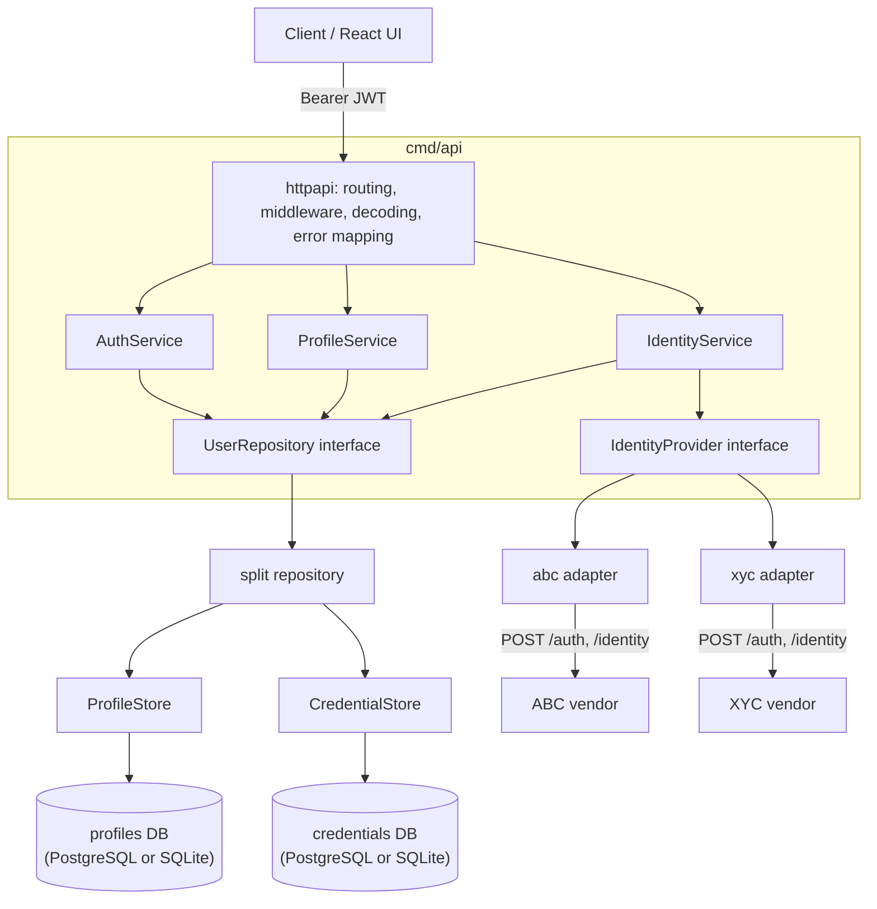
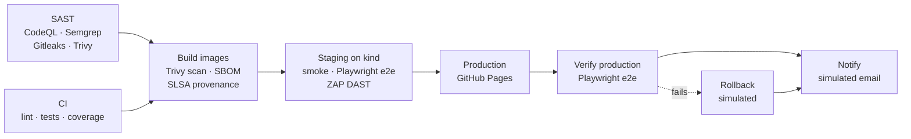

# Rolodex

[](https://github.com/Sun-Wukhan/rolodex/actions/workflows/delivery.yml)
[](https://github.com/Sun-Wukhan/rolodex/actions/workflows/security.yml)
[](https://sun-wukhan.github.io/rolodex/)

| | |
| --- | --- |
| **Live demo** | https://sun-wukhan.github.io/rolodex/ (static build, in-browser API; see [Hosting](#hosting)) |
| **Status page** | https://sun-wukhan.github.io/rolodex-status/ ([source](https://github.com/Sun-Wukhan/rolodex-status)) |

A small identity service built for the LoginID code review exercise. It:

1. stores **user profiles** and **user credentials** behind a database-agnostic DAO
   (repository) with **PostgreSQL** and **SQLite** implementations,
2. exposes a **JWT-secured REST API** to search and retrieve profiles, and
3. connects to **third-party identity providers** (ABC and XYC) through a common
   connector contract to enrich profiles with vendor PII.

The exercise prioritises design and reasoning over completeness, so the code is
deliberately small (about 3k lines of Go plus 1k lines of tests) and every layer is
test-covered. Deeper
rationale lives in [docs/DESIGN.md](docs/DESIGN.md).

## Assumptions

PostgreSQL is the reference datastore. Persistence sits behind a `UserRepository`
interface so SQLite (implemented) or CockroachDB (wire-compatible with the Postgres
implementation) can be substituted without touching business logic. "Multiple
databases" is read as *interchangeable implementations behind one DAO contract*, not
writing to several databases at once.

A user has exactly one profile and one or more credentials (`password`, `oauth`,
`passkey`). Passwords are hashed with Argon2id and are never returned by the API or
written to logs.

Profiles and credentials live in **two separate databases**, each with its own
account: the profiles database (`DATABASE_URL`, `POSTGRES_*`) holds names, phone
numbers and addresses; the credentials database (`CREDENTIALS_DATABASE_URL`,
`CREDENTIALS_DB_*`) holds usernames and password hashes. Under Docker Compose and
Kubernetes they are separate PostgreSQL servers; locally they are two SQLite files. See
[Database design](#database-design).

Profile reads and writes are split: writes go to the profiles primary and reads
(search, profile views) go to a read-only streaming replica (`DATABASE_READ_URL`),
falling back to the primary when the replica lags or is down. See
[Read/write split](docs/DESIGN.md#readwrite-split-for-profiles).

The REST API uses short-lived HS256 bearer JWTs issued by `POST /api/v1/auth/login`.
ABC and XYC are treated as interchangeable implementations of an `IdentityProvider`
interface. Their `/auth` + `/identity` contract is treated as an external contract we
do not control.

External calls use explicit timeouts, bounded retries with jittered exponential
backoff (transient failures only) and normalised errors. A failing vendor degrades
enrichment, it never fails the request.

Production concerns such as distributed tracing, circuit breaking, secret management
and refresh tokens are represented architecturally and listed under
[What I would add in production](#what-i-would-add-in-production) rather than
implemented exhaustively.

Other defaults: UUID identifiers, JSON over HTTP(S), parameterised SQL only,
connection pooling, embedded migrations (goose), structured logging (`log/slog`),
`context.Context` propagated end to end, configuration from environment variables.

## Quick start

There are four ways to run Rolodex. All of the local ones read secrets from a
git-ignored `.env`; create it once:

```bash
git clone https://github.com/Sun-Wukhan/rolodex.git && cd rolodex
make env           # copies .env.example to .env; edit the change-me values
make help          # lists every target, grouped by how you want to run it
```

| Option | Command | Needs | Datastore | Open |
| --- | --- | --- | --- | --- |
| Hosted demo | nothing | a browser | in-browser | https://sun-wukhan.github.io/rolodex/ |
| Local, no Docker | `make dev` | Go 1.26+, Node 22+ | SQLite | http://localhost:5173 |
| Docker Compose | `make up` | Docker | PostgreSQL | http://localhost:3000 |
| Minikube | `make k8s-up` then `make k8s-forward` | minikube, kubectl | PostgreSQL | http://localhost:3000 |

### Signing in

| Where | Username | Password |
| --- | --- | --- |
| `make dev`, `make up`, minikube | `admin` (or `ada`, `grace`, `alan`, `katherine`) | the `SEED_PASSWORD` value in your `.env` |
| Hosted demo (GitHub Pages) | any of the usernames above | anything of 12+ characters |

`make login-info` prints the exact username and password for your `.env`. The seed
only creates missing users, so changing `SEED_PASSWORD` later does not change existing
accounts; reset the data (`make down`, `make k8s-down`, or delete the `*.db` files) and
start again to apply a new one.

Demo flow in the UI: sign in as `admin`, search by name for "a", open a profile and
click **Check all**. Grace gets her missing street and postal code from ABC; Katherine
is verified by both vendors except for ABC's stale street address; Alan is unknown to
ABC but fully enriched by XYC.

### Local without Docker

`make dev` builds the Go binaries, starts the mock vendors (:9001, :9002), seeds two
SQLite files (`backend/rolodex.db` for profiles, `backend/rolodex-credentials.db` for
credentials),
starts the API (:8080) and the Vite dev server (:5173),
prefixing each process's logs. Ctrl-C stops everything. The individual pieces are also
available as `make run-mock`, `make seed-local`, `make run-api` and `make web`.

### Docker Compose

`make up` builds one distroless image for the three Go binaries plus an nginx image for
the UI, and starts three PostgreSQL servers (`postgres` for profile writes, its
streaming replica `postgres-replica` for profile reads, and `credentials-db` for
credentials), the mock vendors, a one-shot seed job, the API and the web app. `make logs` tails the API, `make down` removes everything including data.

| Service      | URL                      | Notes                                 |
| ------------ | ------------------------ | ------------------------------------- |
| Web UI       | http://localhost:3000    | React app served by nginx             |
| API          | http://localhost:8080    | OpenAPI spec in `backend/api/openapi.yaml` |
| Mock vendors | :9001 (ABC), :9002 (XYC) | XYC injects 503s to exercise retries  |

### Minikube

```bash
make k8s-up        # starts minikube if needed, builds images inside it, deploys, waits
make k8s-forward   # API -> localhost:8080, web -> localhost:3000 (Ctrl-C to stop)
make k8s-status    # pods, services, jobs, volumes
make k8s-down      # deletes the rolodex namespace
```

Manifests live in [`deploy/k8s`](deploy/k8s) (plain YAML composed with kustomize):

- Three **PostgreSQL** StatefulSets, each with a 1Gi PersistentVolumeClaim and
  readiness probe: `postgres` (profiles primary, takes writes), `postgres-replica`
  (hot standby that streams from the primary and serves profile reads) and
  `credentials-db` (credentials, its own account).
- **API** Deployment with 2 replicas, `/readyz` readiness and `/healthz` liveness
  probes. Migrations take a PostgreSQL advisory lock, so replicas starting together
  never race.
- **Seed** Job (idempotent, retries until both databases are ready), **mock vendors** and
  **web** Deployments.
- The `rolodex-env` Secret is generated from your `.env` by `make k8s-secret`, so no
  credentials are committed. Images are built straight into minikube
  (`imagePullPolicy: Never`); no registry is involved.
- Pods run as non-root with a `RuntimeDefault` seccomp profile, no privilege
  escalation, all capabilities dropped, read-only root filesystems for the Go
  containers, no service-account token and resource requests/limits.

Port-forwarding is used instead of an Ingress because it behaves the same on every
minikube driver (on macOS the Docker driver cannot reach node IPs directly).

### Calling the API directly

```bash
TOKEN=$(curl -s -X POST localhost:8080/api/v1/auth/login \
  -H 'Content-Type: application/json' \
  -d '{"username":"admin","password":"<SEED_PASSWORD>"}' | jq -r .access_token)

curl -s "localhost:8080/api/v1/users?name=grace" -H "Authorization: Bearer $TOKEN"
curl -s -X POST "localhost:8080/api/v1/users/<id>/enrich?provider=abc,xyc" \
  -H "Authorization: Bearer $TOKEN"
```

## Hosting

GitHub Pages serves static files only, so it cannot run the Go API or PostgreSQL.
Rather than require a cloud account, the hosted site is a **demo build** of the same
React app:

- `pages.yml` builds `frontend/` with `VITE_DEMO_MODE=true` and deploys it to
  https://sun-wukhan.github.io/rolodex/. It is the production stage of the
  [delivery pipeline](#cicd-and-workflow), so it only runs after staging passed.
- In demo mode the API client's `fetch` is swapped for an in-browser implementation of
  the Rolodex API ([`frontend/src/demo`](frontend/src/demo)). It mirrors the backend's
  validation, search semantics, phone normalisation and enrichment merge rules over the
  same seed and mock-vendor datasets, and is unit tested through the real API client.
  Data lives in memory and resets on reload.
- No password is embedded in the bundle: any seeded username signs in with any 12+
  character password, and the login page says so.
- Deep links work through a `404.html` copy of `index.html` (Pages has no SPA
  rewrites), and `VITE_BASE_PATH` serves the app under `/rolodex/`.

The real backend runs locally, in Compose or on minikube. The production path
(Cloud Run + Cloud SQL, deployed by GitHub Actions with Workload Identity Federation) is
described in [docs/DESIGN.md](docs/DESIGN.md#7-deployment-path-not-provisioned).

### Status page

A separate repository, [Sun-Wukhan/rolodex-status](https://github.com/Sun-Wukhan/rolodex-status),
monitors the hosted demo and publishes https://sun-wukhan.github.io/rolodex-status/:

- A GitHub Actions cron job checks every target in `targets.json` every 5 minutes
  (GitHub's minimum interval) and commits status code and latency to a `data` branch.
- The page re-fetches that history **every minute**, probes each target from the
  visitor's browser at the same cadence, and redraws a 24-hour response-time graph with
  outage markers, 24h/7d uptime and a strip of the last 90 checks.
- When the API gets a public URL, adding its `/healthz` to `targets.json` monitors it
  too.

## Architecture



Layers depend inward only: handlers -> services -> interfaces. Concrete databases and
vendors are chosen once in `backend/cmd/api/main.go` (the composition root).

The repository is split into a Go **backend** and a React **frontend**, with the
pieces that span both at the top level:

```
backend/              Go module: API, mock vendors, seed (Dockerfile, go.mod)
frontend/             React + Vite web app (Dockerfile, nginx config, package.json)
e2e/                  Playwright tests against a deployed stack
deploy/k8s/           Kubernetes manifests (kustomize)
scripts/              dev runner, smoke test, DAST
docs/                 design notes
.github/              CI/CD workflows, Dependabot
docker-compose.yml    full local stack;  Makefile  one entry point for everything
```

Inside `backend/`:

```
cmd/
  api/            composition root, graceful shutdown
  mockvendors/    fake ABC (:9001) and XYC (:9002) vendors
  seed/           idempotent demo data loader
internal/
  config/         env-var configuration, validated at startup
  domain/         entities, value types, sentinel errors (no dependencies)
  repository/     UserRepository, ProfileStore and CredentialStore contracts
    split/        UserRepository over separate profiles + credentials databases
    postgres/     PostgreSQL (and CockroachDB) stores
    sqlite/       SQLite stores (pure Go, no cgo)
    repositorytest/  one contract suite run against every implementation
    factory/      picks an implementation from DB_DRIVER and opens both databases
  service/        business logic: auth, profiles, identity enrichment
  provider/       IdentityProvider contract + resilient vendor HTTP client
    abc/ xyc/     vendor adapters (wire format -> domain.Identity)
  httpapi/        chi router, middleware, handlers, error envelope
  security/       Argon2id hasher, JWT issuer/verifier
  mockvendor/     mock vendor implementation used by cmd/mockvendors and tests
migrations/       embedded goose migrations per dialect and database
api/openapi.yaml  API contract
```

Run Go commands from `backend/` (or `go -C backend ...`) and npm commands from
`frontend/`; the Makefile does this for you.

## API

| Method | Path                          | Auth | Purpose                                            |
| ------ | ----------------------------- | ---- | -------------------------------------------------- |
| POST   | `/api/v1/auth/login`          | -    | Username + password -> access token (rate limited) |
| GET    | `/api/v1/me`                  | JWT  | Caller identity                                    |
| GET    | `/api/v1/users`               | JWT  | Search by `name`, `phone`, `username` (AND)        |
| POST   | `/api/v1/users`               | JWT  | Create user + profile + password credential        |
| GET    | `/api/v1/users/{id}`          | JWT  | Profile and credential methods                     |
| POST   | `/api/v1/users/{id}/enrich`   | JWT  | Enrich from `provider=abc,xyc` (default all)       |
| GET    | `/api/v1/providers`           | JWT  | Configured providers                               |
| GET    | `/healthz`, `/readyz`         | -    | Liveness, readiness (datastore ping)               |

Errors always use one envelope:
`{"error":{"code":"invalid_input","message":"...","fields":{...},"request_id":"..."}}`.

## Frontend

`frontend/` is a deliberately thin React 19 + TypeScript + Vite client. The time budget
went into the backend, but the UI demonstrates the API contract end to end.

```
frontend/src/
  api/          typed API client (client.ts), wire types, error description
  auth/         in-memory session context, provider, route guard
  components/   reusable styled-components primitives: Button, TextField, Card,
                Badge, Alert, Spinner, Layout, EnrichmentResults
  demo/         in-browser API used by the static GitHub Pages build
  pages/        login, search, profile + enrichment, add user
  styles/       theme tokens (typed DefaultTheme) and global styles
```

- **Reusable primitives:** components consume theme tokens only, use transient
  `$props` so styling props never reach the DOM, and share semantic `Tone`s
  (`success`, `warning`, `danger`, `info`, `neutral`) between badges and alerts.
- **Session:** the JWT is held in the API client's closure, never in `localStorage`,
  limiting XSS exposure. A 401 or token expiry signs the user out.
- **PII hygiene:** search terms are kept in memory, not in the URL, so names and phone
  numbers stay out of browser history and server logs; cached results are cleared on
  sign-out. `Referrer-Policy: no-referrer` and a CSP are set by nginx.
- **Errors:** the API's field errors map onto form fields; other errors show the
  `request_id` so a support ticket can be traced to a log line.
- **Accessibility:** labelled inputs with `aria-describedby` errors, `role="alert"`
  messages, `aria-pressed` on toggle buttons and visible focus rings.
- **Tests:** Vitest + Testing Library cover the API client, every component and page,
  and the full auth flow (login, 401 auto-logout, sign-out); coverage is ~97%.

## Database design

```
profiles database (DATABASE_URL; read replica at DATABASE_READ_URL)
  users            (id PK, created_at, updated_at)
  user_profiles    (user_id PK/FK -> users, name, phone E.164, street_address,
                    locality, region, postal_code, country)          1:1

credentials database (CREDENTIALS_DATABASE_URL)
  user_credentials (id PK, user_id -> profiles.users, method, username,
                    secret_hash NULL, created_at, last_used_at,
                    UNIQUE(method, username))                        1:N
```

- Profiles and credentials are separate **databases**, not just tables: PII and
  authentication material have different access patterns, retention and audit
  requirements, and a leaked profiles password or backup exposes no password hashes.
  The API refuses to start if both URLs point at the same database.
- No transaction spans the two databases, so the `split` repository orders and
  compensates writes: the credential is written first (its unique username is the
  likeliest conflict), then the user and profile in one transaction; if that fails, the
  credential is deleted again. `user_id` cannot be a foreign key across databases, so
  adding a credential checks that the user exists first.
- Username search resolves matching user IDs in the credentials database, then
  filters profiles by those IDs.
- Each database has its own migration set and goose version table.
- `secret_hash` is nullable because OAuth/passkey credentials carry no shared secret.
- Phone numbers are normalised to E.164 on write so search is an indexed equality.
- Indexes on `phone`, `lower(name)`, `lower(username)` and `user_credentials.user_id`.

## Security decisions

- **Passwords:** Argon2id (OWASP parameters), PHC-encoded so cost can be raised later
  without invalidating stored hashes; constant-time comparison.
- **No user enumeration:** unknown usernames still run a dummy hash verification so
  timing matches, and every login failure returns the same 401.
- **Tokens:** HS256 with a 32+ byte secret from the environment, algorithm pinned on
  verify (rejects `alg=none`/confusion), issuer and expiry required, 15 minute TTL.
- **Input handling:** JSON bodies are size-limited and reject unknown fields and
  trailing data; all inputs are validated and normalised in the service layer (including
  rejecting control characters and invalid UTF-8, which DAST showed Postgres would
  otherwise turn into a 500); SQL is always parameterised and `LIKE` wildcards in user
  input are escaped.
- **PII-safe logging:** the request logger records the route pattern, never the raw
  URL, so names and phone numbers in query strings never reach logs. Provider logs
  record status and latency only.
- **Search requires a filter**, preventing bulk PII enumeration; results are paginated
  (max 100).
- **Secrets** come only from environment variables (`.env` is git-ignored; production
  would use a secret manager). Vendor `Credentials` redact themselves when formatted.
- **Client IP trust model:** login is rate limited per client IP, and the IP is
  resolved explicitly. By default the TCP peer address is used and client-supplied
  `X-Forwarded-For`/`X-Real-IP` headers are ignored, so an attacker cannot rotate
  headers to evade the limiter or pin a victim's IP to lock them out (chi's
  `middleware.RealIP` trusts those headers blindly and is deliberately not used). Behind
  a load balancer, set `TRUSTED_PROXY_CIDRS` so `X-Forwarded-For` is only honoured
  through known proxies.
- Security headers (CSP, CORP/COEP/COOP, `nosniff`, `frame-ancestors 'none'`,
  Permissions-Policy) are set on every API and web response; containers run as numeric
  non-root users with read-only root filesystems; Postgres is not published to the host.
- **Supply chain:** every GitHub Action is pinned to a commit SHA, images are scanned
  and shipped with an SBOM and signed SLSA provenance, and Dependabot waits 7 days
  before adopting new releases.

### Third-party `/auth` contract

The provider's authentication contract requires a username and password to be supplied
to `/auth`. The connector encapsulates that credential handling and guarantees the
credentials are never logged or persisted. Tokens are cached in memory until 30s before
expiry, and a single re-authentication is attempted on a 401. In production I would
prefer OAuth2 client credentials, mTLS or workload identity where the vendor supports it.

## Provider abstraction and resilience

```go
type IdentityProvider interface {
    Name() string
    Lookup(ctx context.Context, q domain.IdentityQuery) (*domain.Identity, error)
}
```

- `provider.Client` implements the shared vendor contract: per-attempt timeout, up to
  3 attempts with jittered exponential backoff on transport errors, 429 and 5xx only
  (never on other 4xx), token caching with a mutex that also coalesces concurrent
  refreshes, response size limits, and normalised errors (`ErrUnavailable`, `ErrAuth`,
  `ErrBadResponse`, `domain.ErrNotFound`).
- Adapters only map wire formats. ABC returns the spec's shape; XYC deliberately uses
  a different one (`person.full_name`, `msisdn`, `addr.line1/city/state/zip`) to show
  normalisation.
- `IdentityService.Enrich` queries providers concurrently with an overall timeout. The
  local profile is the source of truth: providers fill empty fields, and a provider
  returning the same value is recorded in `verified_by`. Each provider's status
  (`ok`, `not_found`, `unavailable`, `error`) is reported, so one vendor outage yields a
  partial result instead of an error.

The seed data and mock vendor datasets are aligned to show every case: Grace gets her
street and postal code filled by ABC, Katherine's fields are verified by both vendors
except a stale ABC street address, and Alan is unknown to ABC but enriched by XYC.

## Testing

```bash
make test      # unit + SQLite contract tests, race detector
make test-pg   # also runs the contract suite against a throwaway PostgreSQL
make cover     # coverage across internal/... on both databases, fails below 80% (currently ~88%)
make ci        # gofmt, go vet, golangci-lint, coverage gate, govulncheck, frontend checks
make pg-down   # stop the throwaway PostgreSQL container

# Security and post-deploy checks (Docker required)
make sast      # Semgrep, Gitleaks and Trivy, same versions as CI
# against a running stack: `make up`, or `make k8s-up` + `make k8s-forward`
make smoke     # 27 API and web checks (scripts/smoke-test.sh)
make e2e       # Playwright browser tests (e2e/)
make dast      # OWASP ZAP authenticated API scan + web baseline (scripts/dast.sh)
```

- **Repository contract suite** (`repositorytest`): one set of behavioural tests run
  against both SQLite and PostgreSQL, proving the implementations are interchangeable
  (transactions roll back, conflicts map to `ErrConflict`, LIKE escaping, pagination).
- **Service tests** use hand-written fakes for the repository and providers.
- **Provider tests** run the adapters against the mock vendors and scripted
  `httptest` servers: retry counts, no retry on 4xx, re-auth on 401, token caching and
  refresh, context cancellation.
- **HTTP tests** exercise the real router end to end over SQLite: auth, rate limiting
  (including spoofed forwarding headers), validation, error envelope, and that secret
  hashes never appear in responses.
- **Frontend tests** (Vitest + Testing Library) cover the API client, components and
  pages at ~97% statements, with thresholds enforced in `vite.config.ts`.

## CI/CD and workflow

Pull requests run **CI** and **SAST**. Every merge to `main` runs the **Delivery**
pipeline, where each stage gates the next:



| Stage | Workflow | What it does |
| --- | --- | --- |
| **SAST** | `security.yml` (PRs, weekly, and Delivery) | CodeQL `security-extended` for Go and TypeScript; Semgrep (Go, TS/React, secrets, Dockerfile, Kubernetes, Actions rules) failing on ERROR severity; Gitleaks over full git history; Trivy for dependency CVEs, Dockerfile/Kubernetes misconfigurations and secrets, failing on fixable HIGH/CRITICAL; dependency review on PRs. All results go to **Security > Code scanning** as SARIF |
| **CI** | `ci.yml` (PRs, and Delivery) | gofmt, `go vet`, golangci-lint, race-enabled tests on SQLite **and** PostgreSQL, 80% coverage gate, `govulncheck`; ESLint, Prettier, `tsc`, Vitest thresholds, `npm audit`; e2e suite typecheck; kustomize render, shellcheck, actionlint |
| **Build** | `delivery.yml` | Pushes `ghcr.io/sun-wukhan/rolodex-{api,web}:<sha>`, fails on fixable HIGH/CRITICAL image CVEs, generates an SPDX SBOM and attaches signed SLSA build-provenance and SBOM attestations (`gh attestation verify oci://... --repo Sun-Wukhan/rolodex`) |
| **Staging** | `delivery.yml` | Creates an ephemeral kind cluster, deploys the exact images with the same manifests and Makefile targets as minikube, using random per-run credentials. Then runs the **smoke test** (27 API and web checks), the **Playwright e2e** suite and **DAST**: an authenticated OWASP ZAP active scan driven by `backend/api/openapi.yaml`, plus a ZAP baseline scan of the web app. Any alert not triaged in `.zap/*-rules.tsv` fails the stage. Reports and, on failure, cluster diagnostics are uploaded as artifacts |
| **Production** | `pages.yml` (called by Delivery) | Deploys the demo build to GitHub Pages |
| **Verify** | `delivery.yml` | Runs the Playwright suite against the live site |
| **Rollback** | `delivery.yml` | If verification fails, finds the last green release and prints the redeploy command (simulated) |
| **Notify** | `delivery.yml` | Always runs and prints the email a mail step would send, routed by outcome (see below) |
| | `pr-title.yml` | Conventional Commit PR titles so squash merges keep a clean history |
| | `release.yml` | release-please generates `CHANGELOG.md` and release PRs from commit messages |

**Notification routing** (simulated with `echo`, and also written to the run summary):

| Outcome | To | Cc |
| --- | --- | --- |
| Released to production | release managers | commit author |
| SAST or DAST failed | security team | commit author |
| Production verification failed | on-call | release managers, commit author |
| Any other failure before production | commit author | on-call |

Distribution lists come from the repository variables `NOTIFY_RELEASE`,
`NOTIFY_SECURITY` and `NOTIFY_ONCALL`, with `*@rolodex.example` placeholders. Each
message includes the stage results, lead time from commit to notification, and links to
the run, the commit, code scanning and production. To send real email, replace the
`echo` with an SMTP action using credentials stored as secrets.

DAST has already paid for itself: its first run found that a NUL byte in a search term
returned a 500 (now rejected as a 400), and the baseline scan found that nginx dropped
every security header on responses (fixed with a per-location include).

Dependabot (`.github/dependabot.yml`) opens weekly grouped updates for Go modules, npm
(web and e2e), GitHub Actions (SHA pins included) and Docker base images, after a 7-day
cooldown. Workflows default to a read-only `GITHUB_TOKEN`, and each job requests only
the extra scopes it needs: packages and attestations for the build, Pages for
production, security-events for SARIF.

The `staging` and `github-pages` environments can be given required reviewers in the
repository settings to add a manual approval gate before each deployment.

Branching: work happens on short-lived branches (`feat/backend`, `feat/frontend`,
`chore/cicd` in this repo's history) merged into `main` with `--no-ff`. On GitHub,
`main` would be protected to require a passing CI run and an approving review before
merge; that is a repository setting rather than code.

The Go toolchain is pinned in `go.mod` (`toolchain go1.26.8`) because `govulncheck`
flagged reachable standard-library vulnerabilities in earlier 1.26 patch releases.

## Trade-offs

- **`database/sql` with hand-written SQL** over an ORM: explicit, reviewable queries and
  dialect differences kept inside each implementation. Some duplication between the
  Postgres and SQLite packages is accepted in exchange for zero cross-dialect coupling.
- **HS256** over RS256: a single service issues and verifies tokens. With multiple
  verifying services, switch to RS256/EdDSA with a JWKS endpoint.
- **Token in memory on the client** (no refresh token): simpler and avoids long-lived
  bearer material; the user signs in again after 15 minutes.
- **Offset pagination**: fine at this scale; keyset pagination would be used for large
  tables.
- **SQLite uses one connection**: SQLite allows one writer, so this avoids `SQLITE_BUSY`.
  It is a dev/test/single-node option, not the production target.
- **Username search uses `LIKE '%term%'`**: a trigram index (`pg_trgm`) would back this
  at scale.
- **Two databases without distributed transactions**: compensation keeps them
  consistent in normal operation, but a crash between the two writes can leave an
  orphaned credential. A periodic reconciliation job (or an outbox) would clean those
  up in production; two-phase commit was not worth its operational cost here.

## What I would add in production

- OpenTelemetry tracing and RED metrics (request rate, errors, duration) per route and
  per provider.
- A circuit breaker per provider (e.g. `sony/gobreaker`) so a failing vendor is skipped
  quickly instead of consuming retry budget.
- Secrets from a secret manager (GCP Secret Manager / Vault) and key rotation for the
  JWT signing key (`kid` header, JWKS).
- Refresh tokens with rotation, account lockout and MFA; role-based authorization
  (today any authenticated user can search).
- An audit log of who looked up whose PII, field-level encryption for PII at rest, and
  data retention policies.
- Caching provider results with a short TTL, and persisting enrichment results with
  provenance and consent records.
- Deployment: container to Cloud Run via GitHub Actions with Workload Identity
  Federation, Cloud SQL for PostgreSQL, frontend on GitHub Pages or Cloud Storage + CDN.

## AI / tools used

- **Cursor with Claude** was used as a pair-programming assistant: discussing the
  architecture, scaffolding code and tests, and reviewing edge cases (timing-safe
  login, LIKE escaping, retry semantics). Design decisions, scope and trade-offs were
  directed and reviewed by the author, and all code was run and tested locally.
- Libraries: chi (routing), golang-jwt, golang.org/x/crypto/argon2, pgx, modernc.org/sqlite,
  goose (migrations), google/uuid.
- Tooling: Docker Compose, Make, `go test -race`, gofmt/go vet.
