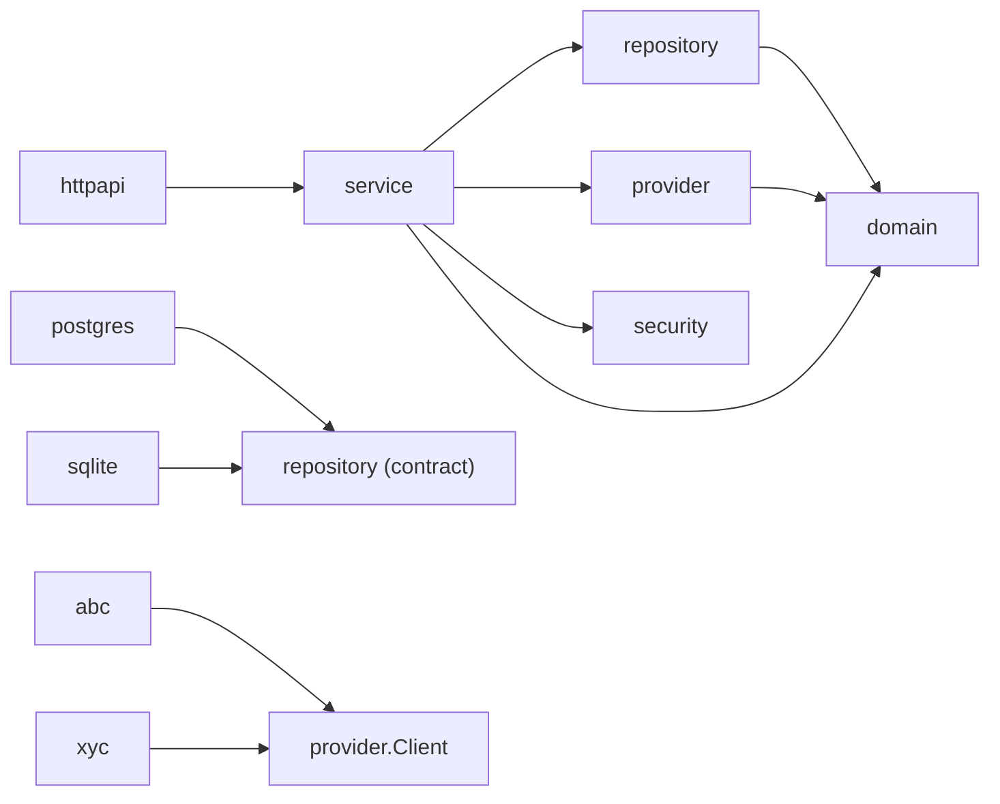
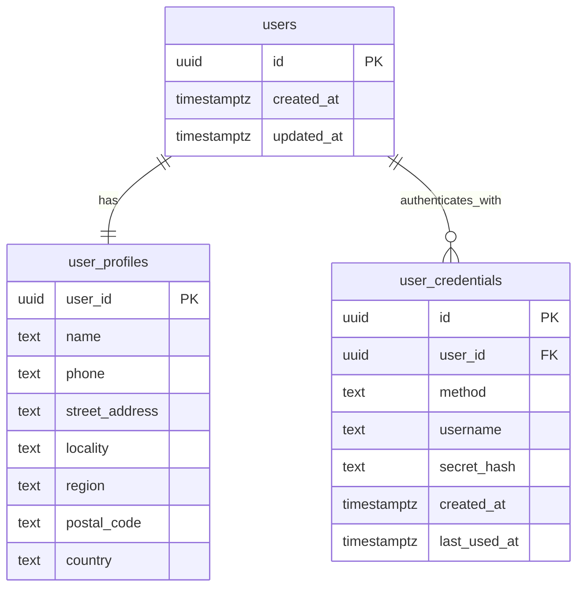
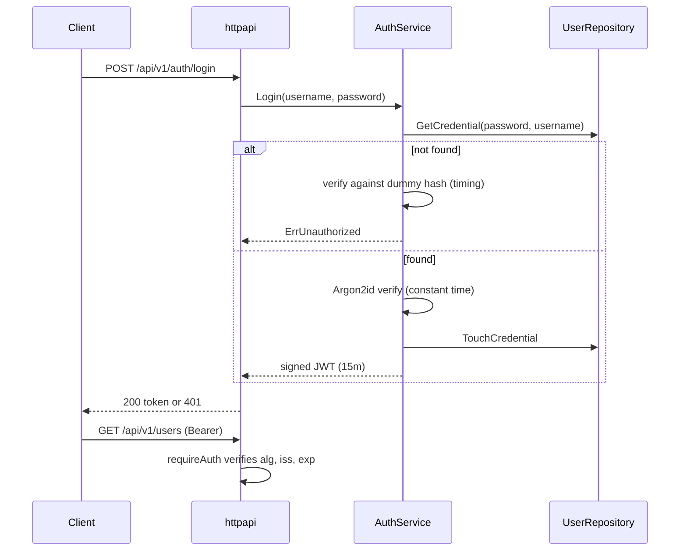
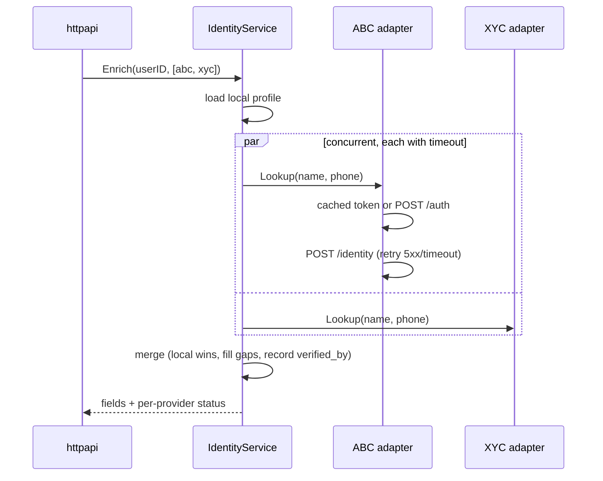
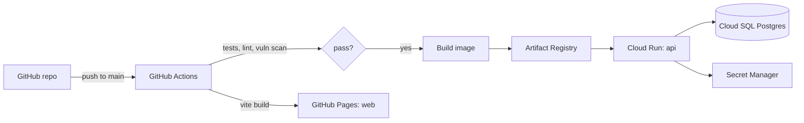

# Rolodex design notes

This document expands on the README with the reasoning behind the main decisions.

## 1. Interpreting the requirements

| Requirement | Interpretation |
| --- | --- |
| DAO for `user_profile` and `user_credential` with multiple databases | One `UserRepository` contract, several interchangeable implementations selected by configuration. Proven by a shared contract test suite. |
| RESTful search/retrieve + security API authentication | JWT bearer auth issued by a login endpoint backed by the stored password credentials; search by name, phone and username. |
| Connector to ABC/XYC with `/auth` and `/identity` | A provider abstraction with a shared resilient client implementing the stated contract, and per-vendor adapters for wire-format differences. |

## 2. Layering and dependency direction

- `domain` has no dependencies. Every other package can use it.
- `service` depends on **interfaces** (`UserRepository`, `IdentityProvider`,
  `PasswordHasher`, `TokenIssuer`). It is unaware of HTTP, SQL or vendors.
- `httpapi` depends on small consumer-defined interfaces (`Authenticator`,
  `ProfileManager`, `Enricher`), so handlers contain no business logic and can be
  tested in isolation.
- `cmd/api/main.go` is the only place that knows about concrete implementations.

## 3. Data model

- `users` is a thin aggregate root, so profile and credentials can evolve, be secured
  and be retained independently.
- `UNIQUE(method, username)` lets the same identifier exist for different methods
  (e.g. a password username and an OAuth subject) while preventing duplicates within a
  method. Usernames are lower-cased on write.
- Address columns are `NOT NULL DEFAULT ''` rather than nullable to keep scanning
  simple and treat "unknown" uniformly. Country is ISO 3166-1 alpha-2.
- Migrations are embedded per dialect and applied at startup with goose's provider API
  (no global state). In production, migrations would run as a separate release step.

## 4. Authentication flow

## 5. Enrichment flow and failure handling

Error taxonomy from providers:

| Error | Meaning | Retried? | Surfaced as |
| --- | --- | --- | --- |
| transport error / timeout / 429 / 5xx | transient | yes, bounded (3 attempts) | `unavailable` |
| 401 on `/identity` | token expired or revoked | one re-auth then replay | `error` if it persists |
| 401/403 on `/auth` | our service credentials are wrong | no | `error` (and logged) |
| 404 | vendor has no match | no | `not_found` |
| other 4xx / undecodable body | contract violation | no | `error` |

Why not `errgroup`? Enrichment must **not** cancel sibling lookups when one fails, so a
`sync.WaitGroup` with per-provider results is the correct primitive here.

## 6. Observability

- One structured JSON log line per request: method, route pattern, status, bytes,
  duration and request ID. The request ID is also returned in error bodies so a user
  report can be correlated with logs.
- Provider lookups log provider, status, latency and error, never the query or PII.
- `/healthz` (liveness) and `/readyz` (datastore ping) for orchestrators.

## 7. Deployment path (not provisioned)

- The CI half of this pipeline exists today (`.github/workflows/ci.yml`): lint, tests on
  SQLite and PostgreSQL with an 80% coverage gate, `govulncheck`, `npm audit`, and image
  builds. Deployment would be a further job gated on `main` that pushes the image to
  Artifact Registry and runs `gcloud run deploy`.
- Cloud Run fits a stateless Go container that scales to zero; GitHub Actions
  authenticates with Workload Identity Federation (no long-lived keys).
- Cloud Run sits behind Google's front end, so the API would set
  `TRUSTED_PROXY_CIDRS` to the load balancer ranges; otherwise every request would
  share the proxy's IP for rate limiting.
- The SQLite implementation keeps local development and tests dependency-free.

## 8. Scaling considerations

- The API is stateless (JWT), so it scales horizontally. The per-IP login limiter is
  in-memory and would move to Redis or the edge (Cloud Armor) with multiple replicas.
- Provider token caches are per instance; that is acceptable because tokens are cheap
  to obtain and are refreshed proactively.
- Search would move to trigram indexes or a search engine if substring matching over
  large datasets became a requirement.
